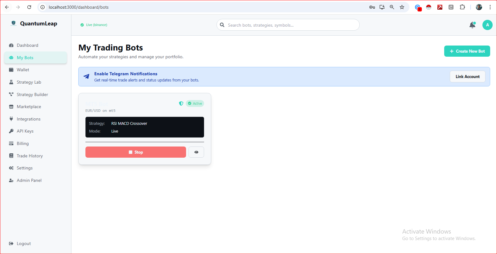

<div align="center">
  
  <h1 align="center">QuantumLeap AI Trader</h1>
  <p align="center">
    A professional-grade, AI-powered algorithmic trading platform with custodial banking, a visual strategy builder, and multi-venue execution capabilities (Crypto & MT5).
  </p>
  
  <!-- Badges -->
  <p align="center">
    
    
    
    
    
  </p>
</div>

---

QuantumLeap AI Trader is a comprehensive, open-source platform designed to bring institutional-grade algorithmic trading tools to individual traders and developers. It moves beyond simple bot execution by offering a complete ecosystem for strategy creation, advanced backtesting, AI-driven market analysis, and multi-asset financial management.

<br/>

<div align="center">
  
  <p><em>Main Dashboard showing Portfolio Overview and Real-Time Market Data</em></p>
</div>

<br/>

## ✨ Core Features: A Professional Trading Ecosystem

QuantumLeap AI is more than just a trading bot; it's a complete financial command center.

| Feature                      | Description                                                                                                                                                                                             | Status      |
| ---------------------------- | ------------------------------------------------------------------------------------------------------------------------------------------------------------------------------------------------------- | ----------- |
| **Multi-Venue Trading**      | Natively connect to and trade on both **Cryptocurrency Exchanges** (via CCXT) and **MetaTrader 5 (MT5)** accounts directly from the platform.                                                               | ✅ Complete |
| **AI Strategy Engine**       | Deploy a suite of advanced, state-aware trading bots, including **Smart Money Concepts (SMC)**, **Volatility Squeeze**, and AI-confirmed signals.                                                          | ✅ Complete |
| **Visual Strategy Builder**  | A production-grade, drag-and-drop interface for creating custom trading strategies without writing a single line of code. Features interactive nodes for indicators, conditions, and actions.             | ✅ Complete |
| **Custodial Wallet System**  | A full-fledged internal banking system with an atomic ledger for managing balances across multiple currencies (**BTC, ETH, USD, JPY, NGN**). Supports deposits, withdrawals, and swaps.                   | ✅ Complete |
| **Strategy Laboratory & Optimizer** | A powerful backtesting engine that can run strategies against historical data from any connected venue (CCXT or MT5). Includes a genetic algorithm for optimizing strategy parameters.          | ✅ Complete |
| **Strategy Sensei (AI Chat)**| An integrated AI assistant powered by **Google Gemini** that helps users build and understand trading strategies using natural language.                                                               | ✅ Complete |
| **Real-Time Architecture**   | Built on an event-driven core with a centralized **WebSocket Market Streamer** for low-latency data and a real-time UI that updates instantly without refreshes.                                        | ✅ Complete |
| **Strategy Marketplace**     | A community hub where users can publish their successful strategies (both free and paid), and other users can subscribe to or clone them.                                                               | ✅ Complete |
| **Desktop Application**      | A cross-platform **Electron** application (Windows & Linux) that bundles the entire stack into a single, high-performance, installable package.                                                         | ✅ Complete |

<br/>

## 📸 Platform Screenshots

<table width="100%">
  <tr>
    <td width="50%" align="center">
      
      <p><em>The intuitive, node-based <strong>Visual Strategy Builder</strong>.</em></p>
    </td>
    <td width="50%" align="center">
      
      <p><em>The <strong>Strategy Lab</strong>, showing backtest optimization results and the AI Sensei.</em></p>
    </td>
  </tr>
  <tr>
    <td width="50%" align="center">
      
      <p><em>The unified <strong>Wallet Page</strong>, displaying both custodial and non-custodial (MT5) balances.</em></p>
    </td>
    <td width="50%" align="center">
      
      <p><em>The <strong>My Bots</strong> page for managing and deploying trading strategies.</em></p>
    </td>
  </tr>
<tr>
    <td width="50%" align="center">
      
      <p><em>The unified <strong>Dashboard Page</strong>, displaying Market Analysis, Profile and Portfolio</em></p>
    </td>
    <td width="50%" align="center">
      
      <p><em>The <strong>My API Keys</strong> Developers can now use API Keys to control trades successfully.</em></p>
    </td>
  </tr>

</table>

<br/>
## Gallery Images can be found <a href="https://quantumleap-images.vercel.app">here</a>

## 🛠️ Tech Stack & Architecture

This project is a monolithic repository but follows a clean separation of concerns, making it highly maintainable and scalable.

| Component                  | Technology & Purpose                                                                                                                                                  |
| -------------------------- | --------------------------------------------------------------------------------------------------------------------------------------------------------------------- |
| **Backend**                | **FastAPI (Python)**: High-performance, asynchronous API server. Handles all business logic, trading, and AI inference.                                               |
| **Frontend**               | **React 18**: Modern, component-based UI. Uses **TailwindCSS** for styling and **Framer Motion** for animations.                                                       |
| **State Management**       | **React Query (@tanstack/query)** for server state (caching, refetching) & **Redux Toolkit** for complex UI state (like the Strategy Sensei chat).                   |
| **Real-Time Communication**| **WebSockets**: For pushing live market data, bot logs, and progress updates from the backend to the frontend instantly.                                                |
| **Database**               | **SQLAlchemy 2.0 (Async)** with **SQLite** for portability. The schema is designed to easily migrate to **PostgreSQL** for large-scale production.                      |
| **Authentication**         | **Firebase Authentication**: Handles secure user sign-up and login. The backend uses **JWTs** for session management and role-based access control.                  |
| **AI & ML**                | **Hugging Face Transformers (FinBERT)** for sentiment analysis. **Google Gemini** for the AI chat assistant. **ONNX Runtime** for loading pre-trained prediction models. |
| **Desktop App**            | **Electron**: Wraps the React frontend and manages the local Python backend executable, creating a cross-platform (Windows/Linux) native application.                   |
| **Packaging**              | **Docker** for server deployment (e.g., on Hugging Face Spaces) and **PyInstaller** for creating the desktop backend executable.                                         |

<br/>

## 🚀 Getting Started

### 1. Prerequisites
- **Node.js** (v18.17+ or v20+)
- **Python** (v3.10 or v3.11)
- A **Firebase** project for authentication.
- API keys for **Google Gemini**, **NewsAPI**, and your chosen payment gateways.

### 2. Backend Setup
```bash
# Navigate to the backend directory
cd backend

# Create a virtual environment
python -m venv venv
source venv/bin/activate  # On Windows: venv\Scripts\activate

# Install all dependencies
pip install -r requirements.txt

# Create and populate your .env file with all required secrets
# (see .env.example)

# Run the server
uvicorn main:app --reload
```
The backend will be live at `http://localhost:8000`.

### 3. Frontend Setup
```bash
# Navigate to the frontend directory in a new terminal
cd frontend

# Install all dependencies
npm install

# Run the React development server
npm start
```
The frontend will open at `http://localhost:3000`.

### 4. Desktop App (Development)
1.  Ensure both the backend and frontend servers are running as described above.
2.  Navigate to the `desktop` directory in a new terminal.
3.  Install dependencies: `npm install`
4.  Run the app: `npm start`

---

## 📜 License
This project is licensed under the MIT License - see the `LICENSE` file for details.

## 🤝 Contact
**Aondover, Pascal Oryiman**
- **Portfolio:** [aondover-portfolio.vercel.app](https://aondover-portfolio.vercel.app)
- **LinkedIn:** [linkedin.com/in/pascal-aondover](https://linkedin.com/in/pascal-aondover)
- **Email:** aondoverpascaloryiman@gmail.com

```


